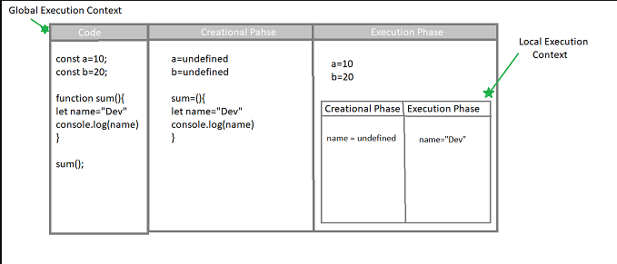

## Q1. Scope

The region where we can access the variable is known as the scope for that variable 
Scope determines the accessibility (visibility) of variables.

JavaScript variables have 3 types of scope:

- Block scope
- Function scope
- Global scope

### Block Scope
Variables declared inside a { } block can NOT be accessed from outside the block.
it is also known as the local scope. it cloud be a if statement, for loop, while loop, or a function.


```jsx
{
  let x = 2;
}
// x can NOT be used here
```

Variables declared with the `var` keyword can NOT have block scope.

Variables declared inside a { } block can be accessed from outside the block.

This is because of the temporal dead zone , we will discuss it later (:

### Global Scope

The variables that can accessed from anywhere in the code are known as global variables 

### Function or  Local Scope

Variables declared within a JavaScript function, are **LOCAL** to the function:

```jsx

function myFunction() {
  let carName = "Volvo";
  // variable carName has local scope because it is declared inside a function 
}

**Question -> Can you tell that the variable carName have local scope or block scope?** 

```

## Q2. Difference Between the == and === operators?

Basically, we used both of the operators for comparison while the main difference is that the === operator in type restricted and  == is not.

Let's consider an example of what actual comparison looks like in both of these operator 

                                                   operand == operand

### 1. ==

In JavaScript, the **`==`** operator is known as the equality operator. When using **`==`**, JavaScript attempts to convert both operands to a common type before making the comparison. This process is called type coercion.

Here are some examples of how the **`==`** operator works:


```jsx
console.log(1 == '1');       // true, '1' is converted to a number
console.log(true == 1);      // true, true is converted to 1
console.log({} == '[object Object]'); // true, both are converted to strings
console.log(null == undefined); // true, null and undefined are considered equal
console.log(0 == NaN);       // false, NaN is not equal to anything including itself
console.log({} == {});       // false, different objects

```

 

### 2. ===

**`===`** operator in JavaScript is known as the strict equality operator. It behaves differently from the **`==`** operator in that it does not perform type coercion. Instead, it requires both operands to be of the **same type** and have the same value for the comparison to return true else it will return false even the value are same but the data type is different.

```jsx
console.log(1 === '1');       // false, number is not equal to string
console.log(true === 1);      // false, boolean is not equal to number
```

## Q3. Function and there types

Functions in JavaScript are blocks of reusable code that perform a specific task. There are several types of functions in JavaScript:

### Simple Functions with functions declaration

These functions are simply defined with the **function** keyword and the name of the function

We can call a function or execute the code of a function by using its name.
let me give you an example. 

```jsx
function print(name){
	console.log(name)
}

print("Dev") // Dev
```

### **Function Expressions or A**nonymous function expression:

What is an expression in Mathematics ?
Evaluating equation into a single value is known as an expression in mathematics.
While in programming, an expression is a combination of variables, operators, and values that evaluates to a single value that can be stored into a variable.

**a=2+4bc** 

Here **a** is a variable while holding an expression “**2+4bc”** 

In functions saving a function into a variable as an expression is known as a function expression

Here is example 

```jsx
const greet = function(name) {
    console.log('Hello, ' + name + '!');
};

```

 They can be named (function expression) or anonymous (anonymous function expression).

We call then anonymous function expression because these functions don’t have there own name that’s they are anonymous

### **Arrow Functions**:

Arrow functions, also known as arrow function expressions, provide a concise syntax for writing functions in JavaScript. They were introduced in ES6 (ECMAScript 2015) and offer a more concise and expressive way to define functions compared to traditional function expressions.

```jsx
const print = (name) => {
    console.log(name);
};

print("Dev"); // Dev

```

## Q4. What is IIFE (Immediately Invoked Function Expression)?
A Immediately Invoked Function Expression (IIFE) is a JavaScript function that runs as soon as it is defined. It is a design pattern that is used to create a private scope for variables to avoid polluting the global scope.To call the function immediately after defining it, we wrap the function in parentheses and then append an additional set of parentheses at the end.
    
    ```jsx
    (function() {
        console.log("Hello World");
    })();
    ```


## Q5. What kind of JS language is , compiled language or intrepeted language ?
JavaScript is an interpreted language, not a compiled language. The major difference between complied language and interpreted language is that complied language is first converted into machine code and then executed while interpreted language is executed line by line.So which means that JS is single threaded language.

```jsx
console.log("Hello World") // this will be executed first then the next line will be executed
console.log("Hello World") // this will be executed after the first line
```

## Q6. What is the difference between null and undefined in JavaScript?
The main difference between null and undefined in JavaScript is that null is an assigned value that represents the absence of a value, while undefined is a variable that has been declared but not assigned a value.Let's consider a example,to store variable value we use a box and if the box is empty then it is null and if the box is not present then it is undefined.


```jsx
let a;
console.log(a); // undefined
```

## Q7. Is JavaScript a synchronous or asynchronous programming language?
### Synchronous Programming
JavaScript is a synchronous programming language, meaning that it executes code line by line in the order it appears in the source code.Which means that it will execute one line of code at a time and move to next line after the execution of the first line.
### Asynchronous Programming
JavaScript is also capable of asynchronous programming, which allows code to run in parallel without blocking the main execution thread. This is achieved using asynchronous functions, callbacks, promises, and async/await.

```jsx 
console.log("Hello World") // this will be executed first
setTimeout(() => {
    console.log("Hello World") // this will be executed after 2 seconds
}, 2000)
console.log("Hello World")  // this will be executed after the first line
```
In the above example, the first and third console.log statements will be executed first, followed by the second console.log statement after a delay of 2 seconds.

## Q8. what is difference between window and document in JavaScript?

| Window | Document |
| --- | --- |
| It is the root level element in any web page. | It is the child element of the window object. |
| It represents the browser window or tab. | It represents the HTML document loaded in the window. |
|By default window object is available implicitly in the page. | You can access it via window.document or document. |
| It has methods like alert(), confirm() and properties like document, location, history. | It has methods like getElementById(), getElementsByClassName() and properties like body, forms. |

## Q9. What is the eval() function in JavaScript?
The eval() function in JavaScript is used to evaluate or execute an argument as an expression. The argument can be a string containing JavaScript code, a function, or an expression. The eval() function is a global function and can be used to execute code dynamically at runtime.

```jsx
console.log(eval('2 + 2')); // 4
```

## Q10. What is the difference between http and https?
HTTP and HTTPS are both protocols used to transfer data over the web, but they operate over different communication channels and have different security mechanisms.The main difference between HTTP and HTTPS is that HTTP is not secure and data is transferred in plain text, while HTTPS is secure and data is encrypted before being transferred.

| HTTP | HTTPS |
| --- | --- |
| HTTP stands for Hypertext Transfer Protocol. | HTTPS stands for Hypertext Transfer Protocol Secure. |
| It operates over port 80. | It operates over port 443. |
| Data is transferred in plain text. | Data is encrypted before being transferred. |
| It is not secure and can be intercepted by attackers. | It is secure and protects against eavesdropping

## Q11. What is the difference between local storage and session storage in HTML5?
Local storage and session storage are both web storage options available in HTML5 that allow developers to store data locally in the user's browser. The main difference between local storage and session storage is the lifetime of the data and the scope of the data.The data saved in session storage is available only for the duration of the page session, while the data saved in local storage persists even after the browser is closed and reopened.


## Q12. What is the ternary operator in JavaScript?
Do you ever heared about the if else statement in JavaScript, the ternary operator is the shorthand version of the if else statement in JavaScript. The ternary operator is a conditional operator that takes three operands: a condition followed by a question mark (?), an expression to execute if the condition is true, and a colon (:) followed by an expression to execute if the condition is false.
  let me write it in general form 
  ** condition ? this will execute if condition true : this will execute if condition is false **
  
  ```jsx
    let marks = 18;
    let result = (marks >= 40) ? 'Pass' : 'Fail';
    console.log(result); // Fail 
```


## Q13. What is the JSON object in JavaScript?
JSON (JavaScript Object Notation) is a lightweight data interchange format that is easy for humans to read and write and easy for machines to parse and generate. JSON is a text-based format and is used to represent structured data. In JavaScript, the JSON object is used to parse and stringify JSON data. The JSON object has two methods: JSON.parse() and JSON.stringify().

```jsx
let person = {
    name: 'John',
    age: 30,
    city: 'New York'
};

let json = JSON.stringify(person);
console.log(json); // {"name":"John","age":30,"city":"New York"}

let obj = JSON.parse(json);
console.log(obj.name); // John
```

---------------- Arrays and objects ------------------------

## Q14. What is the array in JavaScript?
An array in JavaScript is a special type of variable that can hold multiple values at once. Arrays are used to store collections of data, such as a list of numbers or a list of objects.We can save function, object, string, number, boolean in an array.To access the element of an array we use the index of the element.

```jsx 
let numbers = [1, 2, 3, 4, 5];
console.log(numbers[0]); // 1
```

## Q15. What is the object in JavaScript?
An Object is a vairable that can hold multiple values at once. Objects are used to store collections of key-value pairs, where each key is a unique identifier for a value. Objects can contain properties and methods, which are defined as key-value pairs within the object.

```jsx
let person = {
    name: 'John',
    age: 30,
    city: 'New York'
};

console.log(person.name); // John
```

## Q16. What is the forEeach() method in JavaScript?
The forEach() method in JS used to execute a function on every element of an array.We can use the forEach() method to iterate over an array and perform an operation on each element without using a for loop.It will change the original array if we perfoam any operation on element.


```jsx
let numbers = [1, 2, 3, 4, 5];
// I want to add 1 to each element of the array
// We can use forEach method to iterate over the each element of the array and add 1 to each element

numbers.forEach((number, index) => {
    numbers[index] = number + 1;
});

console.log(numbers); // [2, 3, 4, 5, 6]
```

## Q18. What is the map() method in JavaScript?
The map() method in JavaScript is used to create a new array by applying a function to each element of an existing array. The map() method does not change the original array but returns a new array with the results of the function applied to each element.

```jsx
let numbers = [1, 2, 3, 4, 5];
let newNumbers = numbers.map((number) => number * 2);
console.log(newNumbers); // [2, 4, 6, 8, 10]
console.log(numbers); // [1, 2, 3, 4, 5]
```

## Q19. What is the filter() method in JavaScript?
The filter() method in JavaScript is used to create a new array with elements that pass a certain condition. The filter() method does not change the original array but returns a new array with elements that satisfy the condition.

```jsx
let numbers = [1, 2, 3, 4, 5];
let evenNumbers = numbers.filter((number) => number % 2 === 0);
console.log(evenNumbers); // [2, 4]
console.log(numbers); // [1, 2, 3, 4, 5]
```

## Q20. What is the reduce() method in JavaScript?
The reduce() method in JavaScript is used to reduce an array to a single value by applying a function to each element of the array. The reduce() method takes an accumulator and a current value as arguments and returns a single value. The reduce() method can be used to perform operations such as summing the elements of an array or finding the maximum value.

```jsx
let numbers = [1, 2, 3, 4, 5];
let sum = numbers.reduce((accumulator, currentValue) => accumulator + currentValue, 0);
console.log(sum); // 15
```

## Q21. What is the find() method in JavaScript?
The find() method in JavaScript is used to find the first element in an array that satisfies a certain condition. The find() method returns the value of the first element that satisfies the condition, or undefined if no such element is found.

```jsx
let numbers = [1, 2, 3, 4, 5];
let evenNumber = numbers.find((number) => number % 2 === 0);
console.log(evenNumber); // 2
```
## Q22. What is the some() method in JavaScript?
The some() method in JavaScript is used to check if at least one element in an array satisfies a certain condition. The some() method returns true if at least one element satisfies the condition, otherwise it returns false.

```jsx
let numbers = [1, 2, 3, 4, 5];
let hasEvenNumber = numbers.some((number) => number % 2 === 0);
console.log(hasEvenNumber); // true
```

## Q23. What is the every() method in JavaScript?
The every() method in JavaScript is used to check if all elements in an array satisfy a certain condition. The every() method returns true if all elements satisfy the condition, otherwise it returns false.

```jsx
let numbers = [1, 2, 3, 4, 5];
let allEvenNumbers = numbers.every((number) => number % 2 === 0);
console.log(allEvenNumbers); // false
```

## Q24. What is difference between slice() and splice() method in JavaScript?
The slice() and splice() methods are used to manipulate arrays in JavaScript, but they have different purposes and behaviors.

### slice():
The slice() method in JavaScript is used to extract a portion of an array and return a new array without modifying the original array. The slice() method takes two arguments: the start index and the end index (optional). The slice() method returns a new array containing the elements from the start index up to, but not including, the end index.

```jsx
let numbers = [1, 2, 3, 4, 5];
let slicedNumbers = numbers.slice(1, 4);
console.log(slicedNumbers); // [2, 3, 4]
console.log(numbers); // [1, 2, 3, 4, 5]
```

### splice():
The splice() method in JavaScript is used to add or remove elements from an array. The splice() method takes three arguments: the start index, the number of elements to remove, and optional elements to add. The splice() method modifies the original array and returns an array containing the removed elements.

```jsx
let numbers = [1, 2, 3, 4, 5];
let removedNumbers = numbers.splice(1, 2);
console.log(removedNumbers); // [2, 3]
console.log(numbers); // [1, 4, 5]
```

## Q25. What is the difference between rest and spread operator in JavaScript?
The rest and spread operators are both introduced in ES6 (ECMAScript 2015) and are used to work with arrays and objects in JavaScript. The main difference between the rest and spread operators is their usage and syntax. The rest operator is used to gather elements into an array, while the spread operator is used to spread elements from an array.

### Rest Operator:
The rest operator is denoted by three dots (...) and is used to gather elements into an array. The rest operator can be used to collect the remaining arguments of a function into an array or to destructure an array into individual elements.

```jsx
function sum(...numbers) {
    return numbers.reduce((acc, curr) => acc + curr, 0);
}

console.log(sum(1, 2, 3, 4, 5)); // 15
```

### Spread Operator:
The spread operator is also denoted by three dots (...) and is used to spread elements from an array. The spread operator can be used to copy an array, concatenate arrays, or pass elements of an array as arguments to a function.

```jsx
let numbers = [1, 2, 3];
let newNumbers = [...numbers, 4, 5];
console.log(newNumbers); // [1, 2, 3, 4, 5]
```

## Q26. How to delete a key from the object?
To delete a key from an object in JavaScript, you can use the delete operator. The delete operator removes a property from an object. Here is an example of how to delete a key from an object:

```jsx
let person = {
    name: 'John',
    age: 30,
    city: 'New York'
};

delete person.age;

console.log(person); // { name: 'John', city: 'New York' }
```

## Q27. How to check that a key exists in an object?
To check if a key exists in an object in JavaScript, you can use the hasOwnProperty() method or the in operator. The hasOwnProperty() method returns true if the object has the specified property, while the in operator returns true if the property exists in the object or its prototype chain.

```jsx
let person = {
    name: 'John',
    age: 30,
    city: 'New York'
};

console.log(person.hasOwnProperty('age')); // true

console.log('age' in person); // true
```


--------------------- Execution Context ----------------------------
## Q28. What is the Execution Context in JavaScript?
The execution context in JavaScript means that how the code execute is JS.The execution context consist of two things or part ** Crational Phase ** and ** Execution Phase **.

### Creation Phase:
In the creation phase,the JS engine creates the global execution context and sets up the memory space for variables and functions.All the variables are stored in the memory space with the value of undefined and the function definition is stored in the memory space. 

```jsx

let a=10; // In creations phase the value of all variables store as undefined
let b=a;  // As the value of a is undefined so the value of b will be undefined

function print(){
    console.log("Hello World")
} // In creation phase the value of print will hold the function definition


```
### Execution Phase:
In the execution phase, the JavaScript engine assigns values to variables and executes the code line by line. The JavaScript engine starts executing the code from the top of the file and moves down line by line. The JavaScript engine assigns values to variables, evaluates expressions, and executes function calls during the execution phase.

```jsx
let a=10; // In creations phase the value of all variables store as undefined

const print = function(){
    console.log("Hello World")
} // In creation phase the value of print will hold the function definition

print() // Hello World
```
|  JS Code | Creation Phase | Execution Phase |
| --- | --- | --- |
| let a=10; | a=undefined | a=10 |
| const print = function(){console.log("Hello World")} | print=undefined | print=function(){console.log("Hello World")} |
| print() | | console.log("Hello World") |
| function show(){console.log("Hello World")} | show={function definition} | |


## Q29. What is the Global Execution Context and Function or Local Execution Context in JavaScript?

### Global Execution Context:
When a JavaScript program starts, the JavaScript engine creates the global execution context. The global execution context is the outermost context and is responsible for executing the global code. The global execution context consists of the global object, the this keyword, the scope chain, and the variable object.

### Function or Local Execution Context:
When a function is called in JavaScript, the JavaScript engine creates a new execution context for that function. This new execution context is known as the function or local execution context. This function execution context is also consist of two parts ** Creation Phase ** and ** Execution Phase **. The variables declared inside the function have local scope and are only accessible within that function. When the function completes execution, its execution context is removed from the stack.
We use **call stack** to determine the order of local execution context

```jsx
function print() {
    let message = 'Hello World';
    console.log(message);
}

print(); // Hello World
```


## Q30. What is the call stack in JavaScript ?

Whenever a function is called in JavaScript, the JavaScript engine creates an execution context for that function and adds it to the call stack.Call Stack is used to maintain the order of execution. The call stack is a data structure that stores information on the based on the LIFO (Last In, First Out) principle.When a function created it add to the call stack. Soon the function completes execution means it's 2nd part of execution context of function  removed from the stack.
When our script is loaded, the global execution context is added to the call stack. As functions are called, their execution contexts are added to the call stack, and when they complete execution, their execution contexts are removed from the stack.

```jsx
const a=10;
const b=20;

function sum(){
    let name="Dev"

    function print(){
        console.log("hellow World")
    }
}

```


## Q31. What is event loop is JS ?
The event loop in JavaScript is a mechanism that allows the JavaScript engine to perform non-blocking I/O operations. The event loop is responsible for handling asynchronous operations such as setTimeout(), setInterval(), and AJAX requests. The event loop continuously checks the call stack and the callback queue to determine which function to execute next. There are two type of queue in the event loop ** Microtask Queue ** and ** Macrotask Queue **
Before understaning them let's understand the call stack and event loop workflow
As we know that our code consist of functions and variables.When a function execute JS push it's execution context on CALL STACK.While on the other hand if there is any event that will be occur in future will be push to event loop and forward to the callback queue.Event loop check the call stack and callback queue everytime, as soon as the event loop find out that there is task in queue and call stack is empty it will push the task to the call stack and execute it.But there are two type of queue in the event loop ** Microtask Queue ** and ** Macrotask Queue **
### Microtask Queue:
Microtask queue include the task that are high priority task like promise, async await, mutation observer etc. The microtask queue is checked before the macrotask queue and the callback queue. The microtask queue is emptied before the macrotask queue is checked.

### Macrotask Queue:
Macrotask queue include the task that are low priority task like setTimeout(), setInterval(), setImmediate(), requestAnimationFrame(), I/O, UI rendering etc. The macrotask queue is checked after the microtask queue and the callback queue. The macrotask queue is checked after the call stack is empty and the microtask queue is empty.


 

## Q31. What is the Hoisting in JavaScript?
As we already know that in the creation phase the value of all variables store as undefined and the function definition is stored in the variable object.So which means that i can access the variable before it is declared while executing the code. This is known as the hoisting in JavaScript.


**Hoisting only works for the function declaration and variable declared with var keyword not with let and const keyword**
```jsx
console.log(a); // undefined
var a = 10;

show(); // Hello World

function show() {
    console.log('Hello World');
}

```

## Q32. Hiosting in case of let and const in JavaScript?
Hoisting only works for the function declaration and variable declared with var keyword not with let and const keyword. When we use let and const keyword to declare a variable, the variable is hoisted to the top of the block scope but not initialized. This means that you cannot access the variable before it is declared, and you will get a ReferenceError if you try to access the variable before its declaration.This is known as the temporal dead zone.It is the time between the variable hoisted to the top of the block scope and the variable initialized.

```jsx
console.log(a); // ReferenceError: Cannot access 'a' before initialization
let a = 10;

console.log(b); // ReferenceError: Cannot access 'b' before initialization
const b = 20;
```
## Q33. What is temporal dead zone in JavaScript?
The temporal dead zone is a period between the variable hoisted to the top of the block scope and the variable initialized. At this time you cannot access your variable and if you try to access the variable you will get a ReferenceError.As we know that our executon context consist of two parts **Creation Phase** and **Execution Phase**. So the temporal dead zone is the time between the variable cretion phase and the variable initialization phase.At this time TDZ hold all the variables and make them unaccessible however the variable are in the scope.

```jsx
// Temporal Dead Zone - TDZ start from here for variable a
// Still hold the variable a in the TDZ beacuse we still not reach to the 
//  initialization phase or line at which the variable is declared
console.log(a); // ReferenceError: Cannot access 'a' before initialization
//  beacuse the variable a is still in the TDZ

let a = 10; // Initialization phase or line at which the variable 
// is declared,At this time the variable a is removed from the TDZ and accesible now

```

## Q34. Exercising the hoisting in JavaScript?

```jsx
console.log(a); // Guess the output

var a = 10;

function a(){
    console.log("Hello World")
}

console.log(a); // Guess the output
```
```jsx
console.log(a); // Guess the output

var a = 10;

a =function sum(){
    console.log("Hello World")
}

console.log(a); // Guess the output
```

```jsx
console.log(b); // Guess the output

var a=b=10;

console.log(b); // Guess the output
```

```jsx

show(); // Guess the output
showUsingVar(); // Guess the output
const show=()=>{
    console.log("Hello World")
}
var showUsingVar=()=>{
    console.log("Hello World")
};

```


## Q35. What is the difference between var, let, and const in JavaScript?
In JavaScript, var, let, and const are used to declare variables, but they have different scopes and behaviors. The main differences between var, let, and const are:
| var | let | const |
| --- | --- | --- |
| Variables declared with var are function-scoped. | Variables declared with let are block-scoped. | Variables declared with const are block-scoped. |
| Variables declared with var are hoisted to the top of their function or global scope. | Variables declared with let are hoisted to the top of their block scope but not initialized. | Variables declared with const are hoisted to the top of their block scope but not initialized. |
| Variables declared with var can be redeclared and reassigned. | Variables declared with let can be reassigned but not redeclared. | Variables declared with const cannot be redeclared or reassigned. |
| Variables declared with var have global scope if declared outside a function. | Variables declared with let do not have global scope if declared outside a function. | Variables declared with const do not have global scope if declared outside a function. |

```jsx
var a = 10;
let b = 20;
const c = 30;

var a = 40; // No error
let b = 50; // SyntaxError: Identifier 'b' has already been declared
const c = 60; // SyntaxError: Identifier 'c' has already been declared

a = 70; // No error
b = 80; // No error
c = 90; // TypeError: Assignment to constant variable
```


## Q33. What is the scope chain in JavaScript?
The scope chain in JavaScript is the mechanism that determines the order in which variables are resolved in nested functions. When a variable is referenced in a function, the JavaScript engine first looks for the variable in the current function's scope. If the variable is not found, the engine looks in the outer function's scope, and so on, until it reaches the global scope. This process of searching for a variable in nested functions is known as the scope chain.

```jsx
let a = 10;

function outer() {
    let b = 20;

    function inner() {
        let c = 30;
        console.log(a); // 10
        console.log(b); // 20
        console.log(c); // 30
    }

    inner();
}

outer();
```

## Q34. What is the Lexical Scope in JavaScript?
Lexical scope in JavaScript means that the scope of a variable is determined by its position in the source code. When a variable is referenced in a function, the JavaScript engine looks for the variable in the current function's scope and then in the outer function's scope, and so on, until it reaches the global scope. This process of determining the scope of a variable based on its position in the source code is known as lexical scope.

```jsx
let a = 10;

function outer() {
    let b = 20;

    function inner() {
        let c = 30;
        console.log(a); // 10
        console.log(b); // 20
        console.log(c); // 30
    }

    inner();
}

outer();
```

## Q35. What are turty and falsy values in JavaScript?
In JavaScript, truthy and falsy values are values that are considered true or false when evaluated in a Boolean context.These values are mostly used in conditional statements to determine the flow of the program. For example execute this code if user exist otherwise execute this code. Here is code sample 
    
    ```jsx  
    let user = null;

    if(user){
        console.log("User exist")
    }
    else{
        console.log("User not exist")
    }
    ```
How to determine the turty and falsy values in JavaScript? 
- Falsy values: A value is considered falsy if it is false, 0, '', null, undefined, or NaN.
- Truthy values: A value is considered truthy if it is not falsy.

```jsx
console.log(Boolean(false)); // false
console.log(Boolean(0)); // false
console.log(Boolean('')); // false
console.log(Boolean(null)); // false
console.log(Boolean(undefined)); // false
console.log(Boolean(NaN)); // false
console.log(Boolean(true)); // true
console.log(Boolean(1)); // true
console.log(Boolean('hello')); // true
console.log(Boolean({})); // true
```


## Q36. What  is this keyword in JavaScript?
The this keyword in JavaScript refers to the object or scope or context in which code is executed. The value of this depends on how a function is called and where it is called. The this keyword can have different values depending on the context in which it is used.When our web page is loaded the this keyword automatically refer to the window object containing the global variables and functions like
- window.alert()
- window.document
- window.location
- window.history
- setTimeout()
- setInterval()

You can try its value by using the console.log(this) in the browser console.
```jsx
console.log(this); // window object
```

## Q37. What is the  Prototype in Javascript?
Before understanding the difference between call(), apply(), and bind() methods in JavaScript, let's first understand what is prototype in JavaScript.

When a function is created in JavaScript, it is automatically assigned a prototype property. These prototype properties are additional properties that can be added to a function or object automatically . Try to create a object and console log the object

```jsx
function Person(name, age) {
    this.name = name;
    this.age = age;
}

console.log(Person.prototype); // { constructor: [Function: Person] }
```
Let's explain with an object example 
```jsx
let person = {
    name: 'John',
    age: 30,
    greet: function() {
        console.log('Hello, ' + this.name + '!');
    }
};

person.greet(); // Hello, John!
console.log(person) 
```
try to console log the person object and see the prototype property of the object


When you open the prototype property of the object you will see alot of methods like call(), apply(), bind() etc. These methods are used to change the value of this keyword in the function.A prototype itself contains it's own prototype property that leads to null or undefined after lot of chaining like personObject-->prototype--->prototype--->prototype--->prototype--->null or undefined;

How we  access the values from object ?
Whenever we want to access the property of an object we use the dot notation like object.propertyName.behind the scene that happens is that first the JS engine check the object itself contains this property or not if not then it check the prototype property of the object and so on until it reach to the null or undefined.

Confussed ?

Here is an example 

```jsx

const myObject = {
    name: 'John',
    age: 30,
    greet: function() {
        console.log('Hello, ' + this.name + '!');
    }
};

myObject.greet(); // Hello, John!
myObject.toString(); // [object Object]
```
How this happened even i did not define the toString() method in the object ? 
so basically first it look into the object itself and if it does not find the property then it look into the prototype property of the object and find it there 

## Q37. What is function borrowing in JavaScript?
Function borrowing in JavaScript is a technique that allows a function from one object to be used by another object. This is achieved by using the call(), apply(), or bind() methods to change the value of this keyword in the function. Function borrowing is useful when you want to reuse a function that is defined in one object in another object.The scope of the function is changed to the object that is passed as an argument.

```jsx
let person1 = {
    name: 'John',
    greet: function() {
        console.log('Hello, ' + this.name + '!');
    }
};

let person2 = {
    name: 'Jane'
};

person1.greet.call(person2); // Hello, Jane!
```


## Q38. What is the difference between call(), apply(), and bind() methods in JavaScript?

### call():
The call() method of Function instances calls this function with a given this value and arguments provided individually.
```jsx
function greet() {
    console.log('Hello, ' + this.name + '!');
}

let person = {
    name: 'John'
};

greet.call(person); // Hello, John!
```
In the above example, the call() method is used to call the greet() function with the person object as the value of this.

### apply():
The apply() method of Function instances calls this function with a given this value and arguments provided as an array.
```jsx
function greet(complement) {
    console.log('Hello, ' + this.name + '!');
    console.log(complement);
}

let person = {
    name: 'John'
};

greet.apply(person,["Have  a nice day"]); // Hello, John! Have a nice day
```

### bind():
The bind() method of Function instances creates a new function that, when called, has its this keyword set to the provided value, with a given sequence of arguments preceding any provided when the new function is called.
```jsx
function greet() {
    console.log('Hello, ' + this.name + '!');
}

let person = {
    name: 'John'
};

function dummy(){
    let name="Dev"
}
let greetPerson = greet.bind(person);
let dummyFunction = greet.bind(dummy);

greetPerson(); // Hello, John!
dummyFunction(); // Hello, Dev!
```


  


## Q39. What is Lexical Environment in JS ?
Lexical environment is the environment in which the code is executed. It consists of two parts: the environment record and the outer environment reference. The environment record is a mapping of identifiers to values, and the outer environment 


## Q39. What is Clouser  ?
When variables declared inside a inner function can access the variables of outer function , this property is known as Closure.
In other words, the inner function preserves the scope chain of the enclosing function at the time the enclosing function was executed, and thus can access the enclosing function’s variables.
The closure has three scope chains:

    it has access to its own scope — variables defined between its curly brackets
    it has access to the outer function’s variables
    it has access to the global variables
So let's disucss what is scope chain 
Scope Chain is the order in which the JavaScript engine looks for variables when it encounters a reference in the code. The scope chain is determined by the order in which functions are defined in the code, and it is used to resolve variable names based on the lexical scope of the function.let suppose we are in nested function and we are trying to access the variable of outer function then the JS engine first look into the inner function execution context if it does not find the variable then it look into the outer function execution context and so on until it reach to the global execution context.

```jsx
function outer() {
    let a = 10;

    function inner() {
        let b = 20;

        console.log(a); // 10
        console.log(b); // 20
    }

    return inner;
}

let innerFunction = outer();
innerFunction();
```
Let's have an other example 
```jsx
function outer() {var b = 10;
var c = 100;   function inner() {
        
         var a = 20; 
         console.log("a= " + a + " b= " + b);         a++;
         b++;    }
   return inner;
}var X = outer();  // outer() invoked the first time
var Y = outer();  // outer() invoked the second time
//end of outer() function executions
X(); // X() invoked the first time
X(); // X() invoked the second time
X(); // X() invoked the third timeY(); // Y() invoked the first time

```
The Output Will be like 

```h
a=20 b=10
a=20 b=11
a=20 b=12
a=20 b=10
```

----------- AJAX ,CALLBACK , Promises and Async/Await ----------------

## Q40. What is AJAX in JavaScript?
AJAX (Asynchronous JavaScript and XML) is a technique used in web development to create interactive web applications. AJAX allows web pages to be updated asynchronously by exchanging data with a web server behind the scenes. This means that web pages can be updated without reloading the entire page, resulting in a more dynamic and responsive user experience.It is simillar to the fetch() method in JavaScript.We can use the fetch() method to make AJAX requests in modern web applications.So let's discuss how we make API request thorough the AJAX in JavaScript.
First we need to create the instance of the XMLHttpRequest object and then we need to open the request and then we need to send the request to the server and then we need to handle the response from the server.
1. Instance Creation of XMLHttpRequest object
2. Open the request
3. Send the request
4. Handle the response

Before witing the code let's discuss the states of the XMLHttpRequest object
- 0: request not initialized
- 1: server connection established
- 2: request received
- 3: processing request
- 4: request finished and response is ready


```jsx
let xhr = new XMLHttpRequest(); // Step 1: Instance Creation of XMLHttpRequest object

xhr.open('GET', 'https://jsonplaceholder.typicode.com/posts', true); // Step 2: Open the request

xhr.onreadystatechange = function() {
    if (xhr.readyState === 4 && xhr.status === 200) { // checking if the request is finished and response is ready
        let data = JSON.parse(xhr.responseText);
        console.log(data);
    }
}; // Step 4: Handle the response


xhr.send(); // Step 3: Send the request
```


## Q41. What is a callback function in JavaScript?
A callback function is a function that is passed as an argument to another function and is executed after the completion of the first function. Callback functions are used to handle asynchronous operations, such as reading a file or making an API request, and are commonly used in event handling, timers, and AJAX requests.

```jsx
function fetchData(callback) {
    setTimeout(() => {
        const data = 'Hello World';
        callback(data);
    }, 2000);
}

function displayData(data) {
    console.log(data);
}

fetchData(displayData); // Hello World
```

## Q42. What is a Promise in JavaScript?
What actually promises are in real life ? When we make a promise to someone we are saying that we will do something in the future. If we keep our promise, we fulfill it, and if we don't, we break it. Similarly, in JavaScript, a promise is an object that represents the eventual completion or failure of an asynchronous operation. A promise can be in one of three states: pending, fulfilled, or rejected. When a promise is fulfilled, it means that the operation was successful, and the promise returns a value. When a promise is rejected, it means that the operation failed, and the promise returns an error.We also know that every action as a reaction so in both case if our promise is fulfilled then we have to do something and if our promise is rejected then we have to do something. So we use the then() method to handle the fulfillment of a promise and the catch() method to handle the rejection of a promise.

```jsx
let promise=new Promise((resolve,reject)=>{
    setTimeout(()=>{
        let data="Hello World"
        resolve(data)
    },2000)
})

promise.then((data)=>{
    console.log(data)
}).catch((error)=>{
    console.log(error)
})
```


## Q43. What is Async/Await in JavaScript?
Async/Await is a modern way to handle asynchronous operations in JavaScript. Async/Await is built on top of promises and provides a more readable and concise syntax for handling asynchronous code. The async keyword is used to define an asynchronous function, and the await keyword is used to pause the execution of an asynchronous function until a promise is settled. Async/Await makes it easier to write and maintain asynchronous code by allowing you to write asynchronous code that looks synchronous.

```jsx
 function fetchData() {
    return new Promise((resolve, reject) => {
        setTimeout(() => {
            const data = 'Hello World';
            resolve(data);
        }, 2000);
    });
}

async function displayData() {
    const data = await fetchData();
    console.log(data);
}


```


// Stack and Heap
## Q1. What is the difference between the stack and the heap in JavaScript?
The stack and the heap are two types of memory storage in JavaScript that are used to store data and variables. The stack is used to store primitive data types and function calls, while the heap is used to store objects and complex data structures.


## Q17. what is meant by call back function in JavaScript?
A callback function is a function that is passed as an argument to another function and is executed after the completion of the first function. Callback functions are used to handle asynchronous operations, such as reading a file or making an API request, and are commonly used in event handling, timers, and AJAX requests.

```jsx
function fetchData(callback) {
    setTimeout(() => {
        const data = 'Hello World';
        callback(data);
    }, 2000);
}

function displayData(data) {
    console.log(data);
}

fetchData(displayData); // Hello World
```


